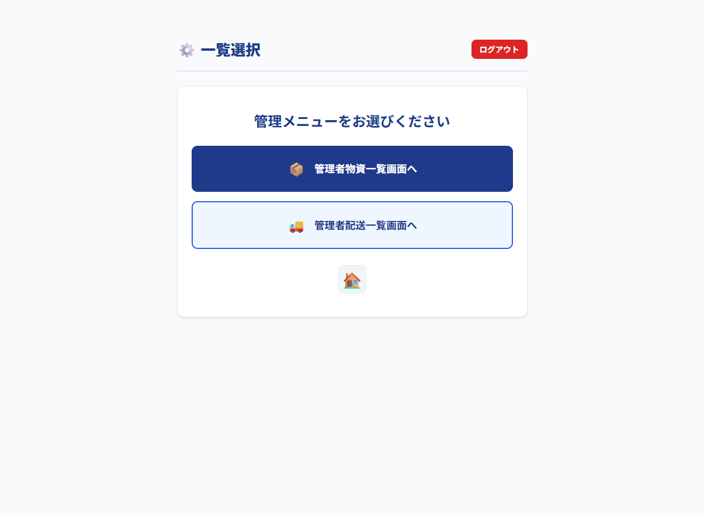
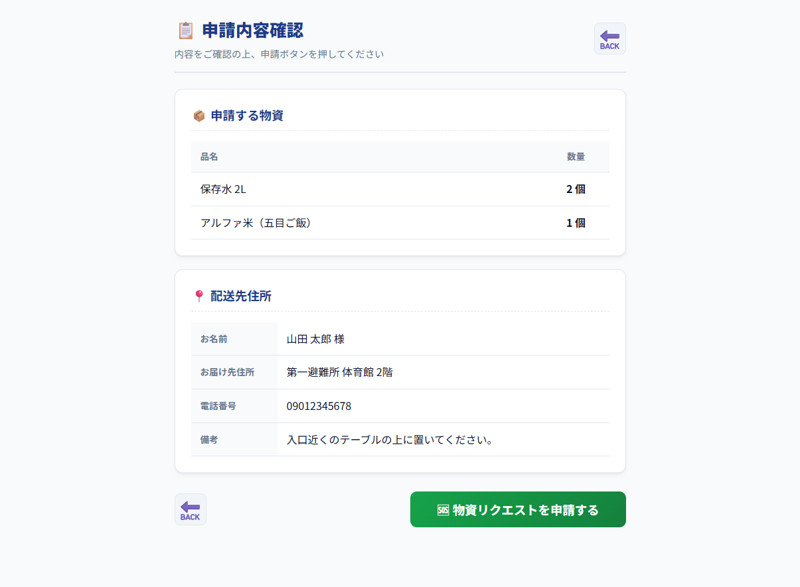
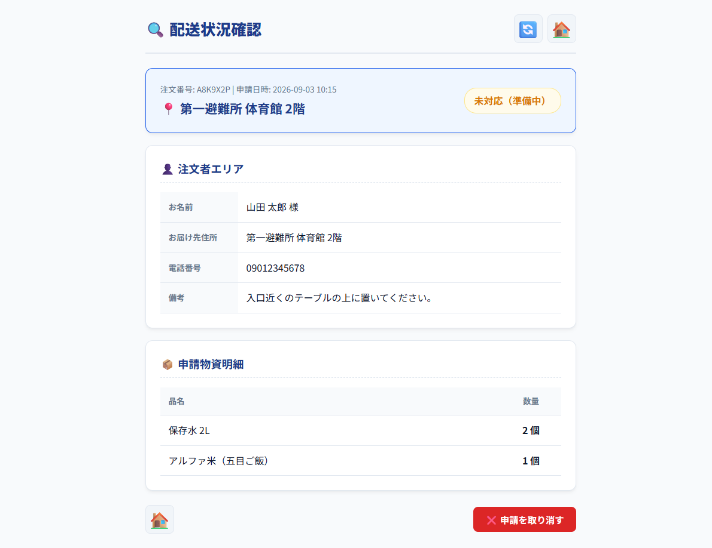
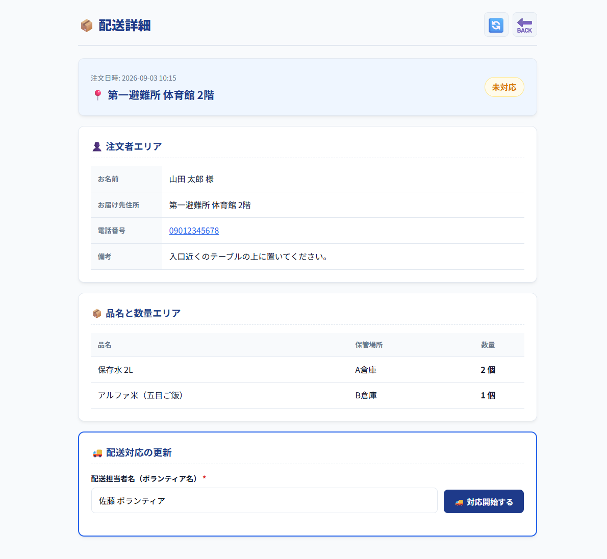
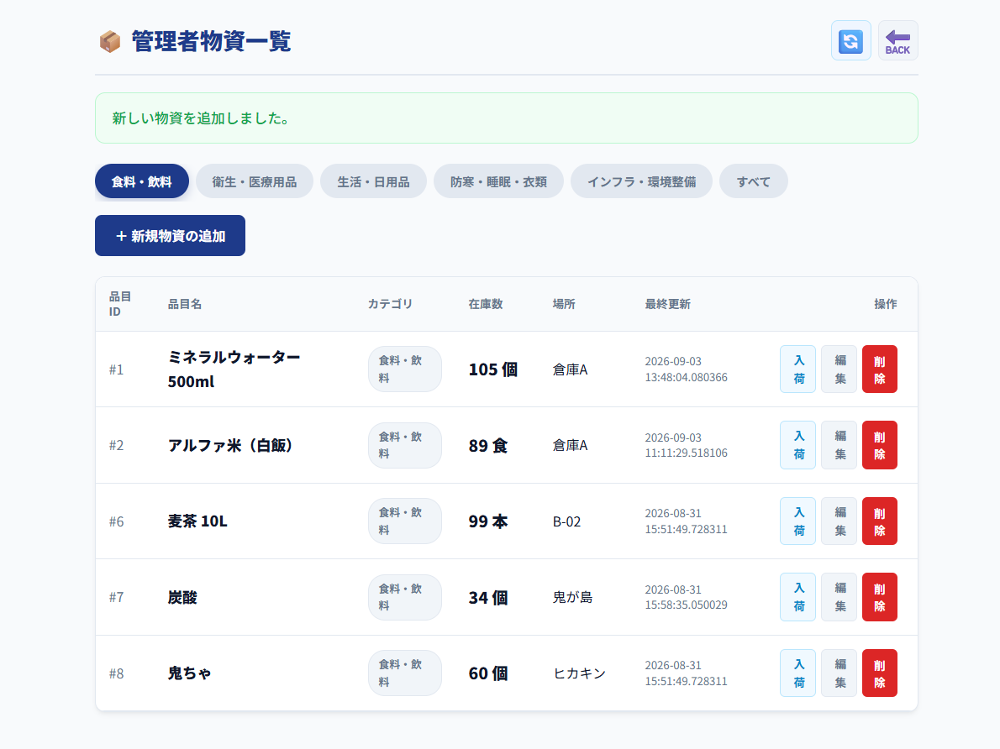
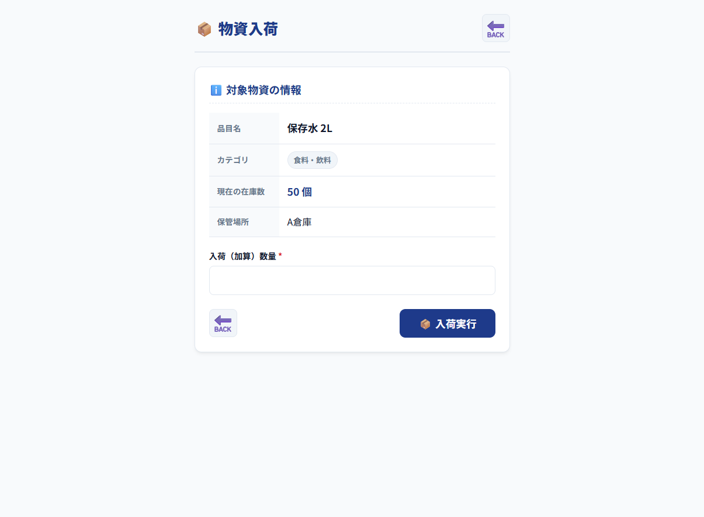
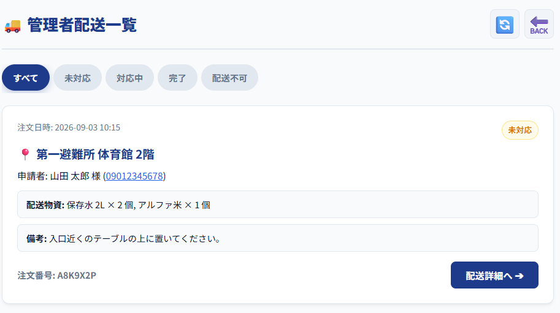
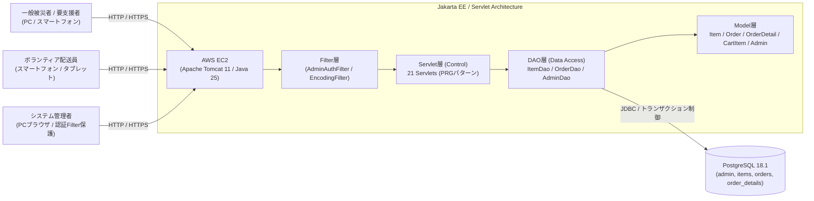

# アプリケーション「ラストワンマイル 物資配送アプリ」
### （避難所ラストワンマイル物資配送支援システム）

[](https://openjdk.org/)
[](https://tomcat.apache.org/)
[](https://www.postgresql.org/)
[](https://aws.amazon.com/)
[](https://www.eclipse.org/)
[](https://a5m2.mmatsubara.com/)
[](https://antigravity.google/)

災害発生時における避難所や孤立地域・要支援者への「ラストワンマイル」救援物資配送を円滑かつ迅速に支援するための Web アプリケーションです。  
「一般被災者（物資要請・状況確認）」「ボランティア配送員（配送管理・進捗更新）」「システム管理者（物資マスタ・在庫・配送統括）」の 3 つの主要ロールをシームレスに連携。  
同時多発アクセス下での過剰引当や重複着手を防ぐ <strong>悲観的ロック（<code>SELECT ... FOR UPDATE</code>）</strong>、複数品目の引当順序制御による <strong>デッドロック防止</strong>、道路寸断や受取人不在等の例外時に物資の死蔵を防ぐ <strong>自動在庫棚戻し機構</strong> など、エンタープライズ水準のデータ整合性と堅牢性を重視して設計・開発しました。

> [!NOTE]  
> <strong>本プロジェクトは、Java実習時に作成したコンテンツ（ポートフォリオ）です。</strong>  
> * <strong>開発グループ</strong>: Group C（避難所ラストワンマイル物資配送支援）  
> * <strong>開発期間</strong>: 26日 (要件定義、PD、PG)  
> * <strong>開発規模</strong>: 2.3Kstep  
> 
> Java実習全体の成果・指導内容については以下よりご覧いただけます。  
> 👉 <strong>[Java実習の内容はこちら（成果報告ポートフォリオ）](https://github.com/hadano-nobuyuki/ai-programming-training-portfolio)**  
> *(※別タブで開く場合は Ctrl + クリック / Cmd + クリック 推奨)*

---

## 📑 目次
1. [💻 画面イメージ](#-画面イメージ)
2. [✨ 主な機能](#-主な機能)
3. [🧰 使用技術・開発環境](#-使用技術開発環境)
4. [📐 システム構成](#-システム構成)
5. [🌐 動作確認（デモ環境）](#-動作確認デモ環境)
6. [📖 要件定義書・各種設計書](#-要件定義書各種設計書)
7. [🛠️ ローカル環境での実行・セットアップ手順](#️-ローカル環境での実行セットアップ手順)
8. [💡 工夫した点（アーキテクチャ・データ整合性設計）](#-工夫した点アーキテクチャデータ整合性設計)
9. [🧗 苦労した点・得られた教訓](#-苦労した点得られた教訓)

---

## 💻 画面イメージ

*(※ 掲載している画像はシステム画面の一部抜粋です。全画面詳細や業務フローは [要件定義書・各種設計書](#-要件定義書各種設計書) よりご覧いただけます)*

### 1. 【被災者・要支援者向け】物資要請 & 配送状況照会
| 物資選択画面（カテゴリ別） | お届け先入力 & 確認 | 配送状況確認（取消可能） |
| :---: | :---: | :---: |
|  |  |  |
| 在庫のある品目を 5 カテゴリから数量選択 | 連絡先・配送先入力および CSRF 保護付き確定 | 注文番号からステータス確認・未対応時は取消可 |

### 2. 【ボランティア配送員向け】配送業務管理
| 配送依頼一覧（4ステータスタブ） | 配送詳細 & ステータス更新 |
| :---: | :---: |
|  |  |
| 未対応・対応中・配送不可・完了のタブ切替 | 担当者着手（排他制御）・完了報告・配送不可棚戻し |

### 3. 【システム管理者向け】救援物資マスタ & 配送統括
| 管理者物資一覧 & 在庫管理 | 物資入荷画面 | 管理者配送一覧（全体把握） |
| :---: | :---: | :---: |
|  |  |  |
| 物資の登録・編集・入荷・注文履歴チェック付き削除 | 既存物資へのアトミックな在庫補充 | 全注文本部の状況把握・未対応注文の強制削除返還 |

---

## ✨ 主な機能

### 📦 1. 一般被災者・要支援者向け機能
* <strong>救援物資の要請（カート選択）</strong>
  * 在庫が 1 以上の物資のみを 5 つのカテゴリ（食料・飲料、衛生・衣料品、生活・日用品、防寒・睡眠・衣類、インフラ・環境整備）ごとに直感的に選択
  * 入力数量の上限を現在の在庫数に自動補正
* <strong>お届け先入力 & 申請確認</strong>
  * 氏名、お届け先住所、電話番号、特記事項の入力（セッション保持・復元対応）
  * CSRF トークン検証による不正リクエスト・二重送信の防止
* <strong>注文確定 & ランダム注文番号自動発番</strong>
  * Java 側ロジックによる英数字 7 桁の注文番号（<code>order_no</code>）を自動生成
  * 申請完了画面での注文番号通知
* <strong>リアルタイム配送状況照会 & 申請取消</strong>
  * 注文番号の入力による配送状況（未対応 / 対応中 / 配送不可 / 完了）の即時確認
  * 「未対応」ステータス時に限り、ユーザー自身による申請取り消しが可能（ <strong>紐づく物資の在庫を自動返還</strong> ）

### 🚚 2. ボランティア配送員向け機能
* <strong>ステータス別配送依頼一覧</strong>
  * 避難所や要支援者からの配送依頼を 4 つのステータス（未対応 / 対応中 / 配送不可 / 完了）タブでリアルタイム表示
* <strong>配送詳細照会 & 担当着手（排他制御）</strong>
  * 依頼者情報・お届け先・依頼品目一覧の確認
  * 配送担当者名を入力して「対応開始」（ <strong>行ロックによる先着1名の排他更新</strong> ）
* <strong>配送ステータス更新 & 自動在庫棚戻し</strong>
  * 「完了」「未対応への差し戻し（担当解除）」「配送不可」の更新
  * 道路寸断や受取人不在等で「配送不可」となった場合、理由入力を必須化し、 <strong>確保されていた物資の在庫を即座に自動加算返還（棚戻し）</strong> して物資の死蔵を防止

### 🛠️ 3. システム管理者向け機能
* <strong>管理者認証・アクセス制御</strong>
  * サーブレットフィルタ（<code>AdminAuthFilter</code>）による <code>/admin/*</code> 領域の認可制御
* <strong>救援物資マスタ管理</strong>
  * 物資一覧表示、新規物資追加（ジャンル・品名・場所の重複防止バリデーション）
  * 物資情報の編集・更新
  * 在庫入荷機能（数量指定によるアトミックな在庫加算）
  * 物資削除機能（ <strong>過去の注文明細履歴 <code>order_details</code> を検証し、履歴がある品目は整合性保持のため削除を抑止</strong> ）
* <strong>全配送データの統括管理</strong>
  * 全注文のステータス別一覧表示および詳細確認
  * 長期未着手などの「未対応」注文に対する強制削除および在庫自動返還

---

## 🧰 使用技術・開発環境

| カテゴリ | 技術スタック / バージョン |
| :--- | :--- |
| <strong>開発期間</strong> | 26日 (要件定義、PD、PG) |
| <strong>開発規模</strong> | 2.3Kstep |
| <strong>言語・ランタイム</strong> | Java 25 (OpenJDK) |
| <strong>Webコンテナ / APサーバ</strong> | Apache Tomcat 11 |
| <strong>バックエンドアーキテクチャ</strong> | Java (Jakarta EE / Servlet / JSP) - MVC + DAO パターン |
| <strong>データベース</strong> | PostgreSQL 18.1（テーブル生成用 [last_onemile_db.sql](last_onemile_db.sql) を同梱） |
| <strong>インフラ / ホスティング</strong> | AWS (EC2) |
| <strong>統合開発環境 (IDE)</strong> | Eclipse |
| <strong>DB管理・モデリングツール</strong> | A5:SQL Mk-2 |
| <strong>開発支援（AI）</strong> | Antigravity（プログラム設計書駆動型コード生成・静的検証） |

---

## 📐 システム構成



---

## 🌐 動作確認（デモ環境）

AWS 上にデプロイしており、実際に動作をご確認いただけます。

👉 <strong>[「ラストワンマイル 物資配送アプリ」デモサイトはこちら](http://13.193.142.78/mrs)</strong>  
*(※別タブで開く場合は <code>Ctrl + クリック</code> / <code>Cmd + クリック</code> 推奨)*

> <strong>テスト用管理者ログイン情報</strong>  
> * <strong>管理者名</strong>: `管理者A`  
> * <strong>パスワード</strong>: `1234`  
> *(※一般被災者機能およびボランティア機能はログイン不要で自由にご確認いただけます)*

---

## 📖 要件定義書・各種設計書

本リポジトリには、設計書駆動開発（PD駆動）において作成した各種仕様書・設計書一式が同梱されています。

* 📄 <strong>[詳細設計書 (PDF)](詳細設計書.pdf)</strong>: トランザクション境界、悲観的ロック、デッドロック防止、入力バリデーション仕様
* 🗺️ <strong>[画面遷移図 (PDF)](画面遷移図.pdf)</strong>: 全21画面・URLマッピング・画面間セッション変数定義
* 📐 <strong>[クラス設計書 (PDF)](クラス設計書.pdf)</strong>: パッケージ構成（Filter/Servlet/Model/DAO/Util）、クラス図、メソッド定義
* 🔌 <strong>[API仕様書 (PDF)](API仕様書.pdf)</strong>: 全28エンドポイントのHTTPメソッド、入出力パラメータ、レスポンス定義
* 🔄 <strong>[シーケンス図 (PDF)](シーケンス図.pdf)</strong>: 物資申請、取消、ボランティア配送更新、管理者認証フロー
* 🗄️ <strong>[テーブル定義書 (Excel)](テーブル定義書.xlsx)</strong> / <strong>[ER図 (A5:SQL Mk-2)](ER図4.a5er)</strong>: データベース物理設計・制約定義

---

## 🛠️ ローカル環境での実行・セットアップ手順

ローカル環境で本プロジェクトを実行する場合は、以下の環境準備、データベース構築、およびデータベース接続設定を行ってください。

### 1. 前提条件
* <strong>Java</strong>: JDK 25 (OpenJDK)
* <strong>Webコンテナ</strong>: Apache Tomcat 11
* <strong>データベース</strong>: PostgreSQL 18.1
* <strong>統合開発環境</strong>: Eclipse（または任意の IDE）

### 2. データベースの構築（DDLおよび初期データの投入）
プログラムの実行に必要なテーブル群を生成し、初期データを投入します。リポジトリ直下の SQL ファイルをご利用ください。

1. PostgreSQL にて任意のデータベース（例: `last_onemile_db`）を作成します。
2. 作成したデータベースに対して、テーブル生成用 DDL（[<strong>`last_onemile_db.sql`</strong>](last_onemile_db.sql)）を実行してテーブルを作成します。  
   *(※ <code>admin</code>, <code>items</code>, <code>orders</code>, <code>order_details</code> の 4 テーブルおよび外部キー制約が生成されます)*
3. 続けて、初期マスタデータ投入用 SQL（[<strong>`インサート.txt`</strong>](インサート.txt)）を実行し、管理者アカウント・救援物資・サンプル注文データを登録します。  
   *(※ A5:SQL Mk-2、pgAdmin、または <code>psql</code> コマンド等から実行可能です)*

### 3. データベース接続設定ファイルの作成
セキュリティ保護のため、DB 接続設定ファイルはリポジトリ管理外となっています。  
`/src/main/java/` 配下に `db.properties` を作成し、ご自身のローカル DB 環境に合わせて接続情報を設定してください。

#### `db.properties` の記述例
```properties
db.url=jdbc:postgresql://localhost:5432/last_onemile_db
db.user=postgres
db.password=your_password
db.driver=org.postgresql.Driver
```

---

## 💡 工夫した点（アーキテクチャ・データ整合性設計）

### 1. 悲観的排他制御（<code>FOR UPDATE</code>）による同時実行制御と過剰引当の完全防止
災害現場での同時多発的な物資要請や、複数ボランティアによる同時アクセスを想定し、厳密な排他制御を導入しました。
* <strong>在庫引き当て時の行ロック</strong>: 物資確定処理（<code>OrderConfirmServlet</code>）において、<code>SELECT * FROM items WHERE item_id = ? FOR UPDATE</code> を発行。処理中に他ユーザーによる在庫変更をブロックし、在庫不足が発生した場合は即座にロールバックして競合モーダルを返却。
* <strong>配送着手時の排他性</strong>: 複数のボランティアが同一の依頼に同時に「対応開始」を押下した場合でも、行ロックにより先着 1 名のみが「対応中」への更新を成功させ、後着者にはステータス変更検知モーダルを表示して画面をリロードさせます。

### 2. 品目ID昇順ソートによるデッドロックの完全防止
複数種類の物資を同時に注文する際、ユーザーごとにロックを取得する順序が異なると、スレッド間で相互待ちが発生し「デッドロック」に陥る危険があります。  
本システムでは、ロック取得処理に入る前にカート内の物資リストを必ず品目 ID の昇順（<code>Comparator.comparingInt(CartItem::getItemId)</code>）にソートしてから順次 <code>FOR UPDATE</code> を実行することで、 <strong>相互待ちデッドロックの発生を構造的に完全排除</strong> しました。

### 3. 例外・トラブル時に物資の死蔵を防ぐ「自動在庫棚戻し」機構
限られた救援物資を無駄にしないため、業務フローと連動した在庫返還ロジックを実装しました。
* <strong>被災者による取消</strong>: 「未対応」状態でのキャンセル時に、注文に紐づくすべての明細数量を即座に <code>items.stock</code> へ加算返還。
* <strong>ボランティアによる配送不可判定</strong>: 道路寸断や受取人不在等により配送が不可能となった場合、理由（<code>notdelivery_note</code>）の入力を必須としつつ、確保されていた物資在庫を自動的に加算返還（棚戻し）し、即座に他の避難所等へ再配分できるようにしました。

### 4. 堅牢なセキュリティとデータ整合性保護
* <strong>CSRF・二重送信防止</strong>: <code>CsrfTokenUtil</code> によるワンタイムトークンを申請フォームに埋め込み、POST 送信時に検証・即時破棄。ブラウザの戻るボタンや連打による多重注文を防止。
* <strong>外部キー整合性チェック</strong>: 管理者が物資を削除する際、過去の注文明細（<code>order_details</code>）に 1 件でも該当品目が存在する場合は削除を拒絶し、実績データの破損を防ぐ安全機構を構築。

### 5. AI（Antigravity）協調型プログラム設計書（PD）駆動開発
要件定義からプログラム完成までわずか 26 日間という短期間で高品質な実務級システムを構築するため、AI 協調開発を導入しました。
* 要件定義書・画面遷移図から粒度の細かいプログラム設計書（クラス・メソッド・SQL・例外フロー）を作成。
* 設計書を基に AI（Antigravity）にコーディングを行わせ、生成されたコードに対して「SQL インジェクション対策（PreparedStatement 徹底）」「XSS サニタイズ」「DB コネクションリーク防止」「悲観的ロックの正当性」を重点的にレビュー・検証するサイクルを徹底しました。

---

## 🧗 苦労した点・得られた教訓

### 1. 複数同時トランザクションと排他制御の設計精度
単一レコードの CRUD とは異なり、複数物資の同時在庫減算、注文ヘッダと明細の生成、外部キー制約、そして他者による同時着手が入り乱れるトランザクション処理の整合性を担保することに苦心しました。  
「どのタイミングで <code>setAutoCommit(false)</code> を呼ぶべきか」「どの順序でロックを取ればデッドロックを防げるか」「どの異常系でロールバックし、画面をどう再同期させるか」をシーケンス図および詳細設計書レベルで突き詰めたことで、 <strong>実務で通用する堅牢なトランザクション設計力</strong> を培うことができました。

### 2. AI協調開発における「設計書の厳密性・言語化力」の重要性
AI に実装を依頼する際、設計書の記述に曖昧さ（主語の欠落、例外フローの未定義、null 時の挙動の未記載など）があると、生成されるコードに想定外の分岐が紛れ込む課題に直面しました。  
コードを直接手修正するのではなく、「 <strong>不備があれば設計書側にフィードバックして仕様を明確化し、AIに再生成させる</strong> 」というルールを徹底したことで、設計書の必要十分条件とは何かを深く理解し、人に伝える場合でも AI に指示する場合でも不可欠な「論理的思考力と仕様の言語化能力」が飛躍的に向上しました。
